# 2. Decoupled Network and Communication Modeling

## 2.1 Heterogeneous Nodes and Three-Layer Architecture

Let $V(t)$ denote the set of active UAV nodes at time $t$. The swarm is heterogeneous in functional role, and the node set is partitioned as

$$
V(t) = V_S(t) \cup V_D(t) \cup V_I(t),
$$

where $V_S$, $V_D$, and $V_I$ denote the sensor (reconnaissance), decider (command-and-control), and influencer (strike) node subsets, respectively. Each role occupies a distinct position in the OODA loop: sensor nodes observe and report battlefield intelligence; decider nodes fuse information and issue directives; influencer nodes execute kinetic or electronic strikes. In operational deployment, the initial cardinalities of the three subsets satisfy

$$
|V_S(0)| > |V_D(0)| > |V_I(0)|,
$$

reflecting a force composition in which low-cost sensor platforms constitute the largest population, command nodes serve as coordination hubs, and high-value strike units are held at minimal count. This asymmetric configuration is not merely a parametric assumption; it is a structural prior that constrains the role-dependent communication logic developed in Section 2.2.

The temporal evolution of the swarm is organized by a mission-stage function $\Phi(t)$, defined as

$$
\Phi(t) = \begin{cases} 1, & 0 \le t < t_{\mathrm{switch}} \quad (\text{reconnaissance stage}), \\ 2, & t \ge t_{\mathrm{switch}} \quad (\text{strike stage}). \end{cases}
$$

The switching instant $t_{\mathrm{switch}}$ is defined as the **Intelligence Freeze** moment — the instant at which the last active sensor node completes its situational awareness report or receives confirmation of data acceptance from a decider. This event marks the transition from the uncertainty-reduction phase, in which the swarm converges on a coherent operational picture, to the fire-execution phase, in which communication resources are reallocated from intelligence aggregation toward command authorization and strike coordination. This definition ties the stage transition directly to information completeness rather than to a fixed clock boundary.

The swarm system is modeled as three decoupled but interdependent network layers, each defined over the same node set $V(t)$ but representing qualitatively distinct types of inter-node relations.

**Physical layer** $G_{phy}$: This layer captures spatial reachability. An undirected edge between nodes $i$ and $j$ exists if and only if their Euclidean separation satisfies $d_{ij}(t) \le r_c$, where $r_c$ is the maximum communication radius. $G_{phy}$ encodes which pairs of UAVs are physically within radio range and serves as the geometric substrate on which all higher-layer interactions are contingent.

**Communication layer** $G_{comm}$: This layer is a directed graph characterizing the stochastic activation of communication links through the instantaneous activation probability of each directed link. An edge from $i$ to $j$ in $G_{comm}$ is dynamically realized according to the probability $P_{ij}(t) \in [0,1]$ (detailed in Section 2.2), representing the likelihood that node $i$ actively initiates communication toward node $j$ at time $t$. As a result, the connectivity of the graph evolves over time in a probabilistic manner. Because communication intention is role-dependent and mission-stage-dependent, $P_{ij}(t) \neq P_{ji}(t)$ in general. $G_{comm}$ serves as the bridge between the geometric constraints of $G_{phy}$ and the mission-oriented interaction logic of $G_{mis}$.

**Mission layer** $G_{mis}$: This layer encodes OODA-compliant kill-chain interaction. A directed edge from $i$ to $j$ exists in $G_{mis}$ only when three conditions are jointly satisfied: (i) physical reachability holds ($d_{ij}(t) \le r_c$); (ii) communication viability holds ($P_{ij}(t) \ge \tau_{mis}$, where $\tau_{mis}$ is a minimum communication-viability threshold set according to mission requirements); and (iii) the node-role pair $(i,j)$ satisfies a valid logical transition rule in $\mathcal{R}$ (which defines the permissible role-to-role information flows, as detailed in Section 3.1.3). Valid kill chains in $G_{mis}$ additionally require structural closure from a sensor node to an influencer node, enforcing completeness of the OODA loop. $G_{mis}$ is not a topological derivative of $G_{phy}$; it is the operational layer at which mission-chain completeness and kill-chain execution efficiency are evaluated.

The three layers share the same UAV entities but represent distinct relational semantics: $G_{phy}$ governs spatial reachability, $G_{comm}$ governs directed communication willingness, and $G_{mis}$ governs mission-chain validity. This architecture enables each dimension to degrade and recover at different rates under attack, which is the structural premise for the multidimensional resilience evaluation developed in Section 3.

## 2.2 Mission-Driven Probabilistic Communication

Conventional models of UAV swarm communication treat link activation as a binary function of distance: a link exists or does not, depending solely on whether the separation between two nodes falls within the communication radius. This representation merges two distinct questions — whether nodes can communicate and whether they have functional reason to do so — into a single binary variable, discarding mission-contextual variation that is essential for mission-oriented analysis. The present study decouples these two aspects by defining the instantaneous directed link activation probability $P_{ij}(t)$ as the product of a physical reachability term and a logical matching term:

$$
P_{ij}(t) = f_{\mathrm{phy}}(d_{ij}(t)) \cdot f_{\mathrm{logic}}(i, j, t).
$$

Because each factor is role- and stage-dependent, $P_{ij}(t) \neq P_{ji}(t)$ in general: the activation probability from a sensor node toward a decider node is governed by a different logical weight than the reverse direction, and both weights change as the mission crosses the Intelligence Freeze boundary.

### Physical Reachability Term

Signal quality in wireless channels degrades with separation distance. A pure binary threshold assigns identical link quality to all node pairs within range and imposes a discontinuous drop to zero at the boundary, which is physically unrealistic. To capture progressive channel degradation while retaining a hard cutoff at $r_c$, the physical reachability term is defined as the piecewise function

$$
f_{\mathrm{phy}}(d_{ij}(t)) = \begin{cases} 1, & d_{ij}(t) < \eta r_c, \\ \dfrac{r_c - d_{ij}(t)}{r_c(1 - \eta)}, & \eta r_c \le d_{ij}(t) \le r_c, \\ 0, & d_{ij}(t) > r_c, \end{cases}
$$

where $\eta \in (0, 1)$ is the distance influence factor. Three regions are distinguished. When $d_{ij}(t) < \eta r_c$, nodes operate in the strong-signal region where channel quality is considered perfect ($f_{\mathrm{phy}} = 1$). When $\eta r_c \le d_{ij}(t) \le r_c$, nodes are in the edge-attenuation region, where quality degrades linearly from unity to zero as separation approaches $r_c$; the parameter $\eta$ governs the onset and slope of attenuation. When $d_{ij}(t) > r_c$, no signal is recoverable and $f_{\mathrm{phy}} = 0$. This piecewise design is more physically faithful than binary thresholding because it preserves continuity at the boundary and models the progressive link-quality deterioration that precedes complete disconnection.

### Logical Matching Term

Physical proximity is necessary but not sufficient for a communication link to carry mission value. In a multi-role UAV swarm organized around the OODA loop, each node occupies a well-defined functional position in the kill chain, and communication willingness is constrained not only by distance but by mission-chain compatibility. A sensor node preferentially reports to decider nodes rather than broadcasting uniformly to all reachable peers; a decider node does not solicit mission-status inputs from influencer nodes during the reconnaissance stage. This role-based, stage-dependent interaction logic is quantified by the logical matching term $f_{\mathrm{logic}}(i,j,t)$.

The derivation is grounded in a set of representative kill-chain patterns that collectively describe how the three node roles interact to form complete OODA loops. These eight patterns, defined for this study, are summarized in Table 1.

**Table 1.** Representative kill-chain patterns categorized by functional characteristics and corresponding logical sequences.

| ID | Kill-chain type | Logical sequence |
|:--:|:---|:---|
| 1 | Canonical kill chain | $S \rightarrow D \rightarrow I$ |
| 2 | Kill chain with information sharing | $S \rightarrow S \rightarrow D \rightarrow I$ |
| 3 | Kill chain with collaborative decision-making | $S \rightarrow D \rightarrow D \rightarrow I$ |
| 4 | Kill chain with feedback mechanism | $S \rightarrow D \rightarrow S \rightarrow D \rightarrow I$ |
| 5 | Kill chain with information sharing and collaborative decision-making | $S \rightarrow S \rightarrow D \rightarrow D \rightarrow I$ |
| 6 | Kill chain with information sharing and feedback | $S \rightarrow S \rightarrow D \rightarrow S \rightarrow D \rightarrow I$ |
| 7 | Kill chain with collaborative decision-making and feedback | $S \rightarrow D \rightarrow D \rightarrow S \rightarrow D \rightarrow I$ |
| 8 | Kill chain with information sharing, collaborative decision-making, and feedback | $S \rightarrow S \rightarrow D \rightarrow D \rightarrow S \rightarrow D \rightarrow I$ |

Each pattern specifies a legal sequence of role-to-role information transfers that constitutes a complete OODA cycle terminating in a strike action. To construct the role-transition matrix $\mathbf{\Omega}(\Phi)$, each directed role hop in the eight patterns is treated as an observation, and the frequency of each ordered role pair $(r_i, r_j)$ is tallied separately for the reconnaissance stage and the strike stage — the partition defined by the Intelligence Freeze moment. The resulting frequency counts are then normalized by row to yield conditional transition probabilities. This frequency-based derivation ensures that $\mathbf{\Omega}(\Phi)$ reflects mission-level interaction logic rather than arbitrary parameter assignment: role pairs that appear frequently in representative kill chains receive higher transition weights, directly encoding the operational priorities of each mission phase.

Each node $i$ is assigned a one-hot role vector $\mathbf{X}_i \in \{0,1\}^3$ encoding its functional identity:

$$
\mathbf{X}_i = \begin{cases} [1,0,0]^T, & i \in V_S, \\ [0,1,0]^T, & i \in V_D, \\ [0,0,1]^T, & i \in V_I. \end{cases}
$$

The role-transition frequencies derived from Table 1 are organized into the dynamic role-transition matrix $\mathbf{\Omega}(\Phi) \in \mathbb{R}^{3 \times 3}$, in which entry $\Omega_{ij}(\Phi)$ represents the normalized probability that information flows from a node of role $r_i$ to a node of role $r_j$ under mission stage $\Phi$. To prevent zero-probability entries from producing pathological communication suppression for valid but infrequently observed transitions, Laplace smoothing is applied:

$$
\Omega_{ij}(\Phi) = \frac{\mathrm{Count}(r_i \to r_j \mid \Phi) + \varepsilon}{\displaystyle\sum_{k \in \{S,D,I\}} \bigl(\mathrm{Count}(r_i \to r_k \mid \Phi) + \varepsilon\bigr)},
$$

where $\varepsilon$ is a small background factor representing a residual interaction probability, ensuring that no logical path is permanently blocked due to sampling deficiency.

The two stage-specific matrices take qualitatively distinct forms, derived from the role-hop frequencies implied by the eight patterns in Table 1. During the reconnaissance stage ($\Phi = 1$), the dominant transitions are sensor-to-decider intelligence aggregation ($S \to D$) and decider-to-sensor feedback ($D \to S$), consistent with the imperative to converge on a coherent operational picture before the Intelligence Freeze. Based on the aggregated transition counts from Table 1 ($S \to S$: 4, $S \to D$: 12, $D \to S$: 4, $D \to D$: 2), the row-normalized reconnaissance-stage matrix is approximately

$$
\mathbf{\Omega}_{\mathrm{Recon}} \approx \begin{bmatrix} 1/4 & 3/4 & \varepsilon \\ 2/3 & 1/3 & \varepsilon \\ \varepsilon & \varepsilon & \varepsilon \end{bmatrix}.
$$

After the Intelligence Freeze, in the strike stage ($\Phi = 2$), sensor nodes are no longer active in intelligence aggregation (interaction weight $\approx \varepsilon$), and decider nodes reallocate approximately 80% of their communication toward influencer nodes for fire authorization, with the remaining 20% directed to inter-decider target deconfliction. Based on the post-freeze transition counts ($D \to D$: 2, $D \to I$: 8), the strike-stage matrix is approximately

$$
\mathbf{\Omega}_{\mathrm{Attack}} \approx \begin{bmatrix} \varepsilon & \varepsilon & \varepsilon \\ \varepsilon & 1/5 & 4/5 \\ \varepsilon & \varepsilon & \varepsilon \end{bmatrix}.
$$

It is worth noting that the same inter-decider interaction $D \to D$ carries different semantic content across the two stages: in the reconnaissance stage it represents collaborative orientation and situation synthesis, whereas in the strike stage it represents target-assignment deconfliction. The matrix $\mathbf{\Omega}(\Phi)$ captures this stage-dependent semantic evolution through its frequency-derived entries. Both matrices are model-derived quantities, reflecting normalized role-transition frequencies extracted from the eight representative patterns in Table 1; they are not universal empirical constants and may be recalibrated as mission topology or kill-chain doctrine changes.

Given $\mathbf{X}_i$, $\mathbf{X}_j$, and $\mathbf{\Omega}(\Phi(t))$, the logical matching score is obtained by the bilinear expression

$$
f_{\mathrm{logic}}(i, j, t) = \mathbf{X}_i^T \cdot \mathbf{\Omega}(\Phi(t)) \cdot \mathbf{X}_j,
$$

which maps the role identities of the transmitting and receiving nodes onto the mission-stage-specific interaction weight derived from the kill-chain patterns. When the role pair $(i, j)$ aligns with the dominant information flow prescribed by the current stage, $f_{\mathrm{logic}}$ is relatively large and the link is activated with proportionally higher probability; when the pair is role-incompatible or stage-inappropriate, $f_{\mathrm{logic}}$ approaches $\varepsilon$ and the link is effectively suppressed. The term thereby captures role compatibility, stage-dependent interaction willingness, and mission-logic constraints within a single algebraic expression, without relying on topological adjacency alone.

The probabilistic communication mechanism $P_{ij}(t) = f_{\mathrm{phy}} \cdot f_{\mathrm{logic}}$ provides the structural bridge between geometric reachability and mission-oriented resilience evaluation. The remainder of the framework builds on this directed, probabilistic link model to quantify communication orderliness, mission-chain efficiency, and adaptive reconfiguration.

---

# 3. Resilience Evaluation and Adaptive Reconfiguration

## 3.1 Multidimensional Performance Evaluation

The three-layer architecture introduced in Section 2 implies that system performance cannot be adequately characterized by any single metric. Node losses degrade physical integrity; role-misaligned or distance-attenuated links reduce communication orderliness; fragmented kill chains diminish mission effectiveness. These three dimensions may degrade and recover at different rates and through different mechanisms. To capture this multidimensional character, a layer-wise performance function is constructed for each layer and aggregated into a unified system performance index $Q(t)$.

### 3.1.1 Physical-Layer Performance

The physical layer $G_{phy}$ represents the material substrate of the swarm. Its performance reflects the structural integrity and connectivity quality of the surviving node set, assessed through four normalized indicators.

Let $N(t)$ be the number of surviving nodes at time $t$ and $N(0)$ the initial count. The node survival ratio $n(t) = N(t)/N(0)$ measures the fraction of the swarm that remains operationally present. The average degree $K(t)$ and average clustering coefficient $C(t)$ are defined as

$$
K(t) = \frac{1}{N(t)} \sum_{i=1}^{N(t)} k_i(t), \qquad C(t) = \frac{1}{N(t)} \sum_{i=1}^{N(t)} C_i(t),
$$

where $k_i(t)$ is the degree of node $i$ and $C_i(t)$ is its local clustering coefficient. The global efficiency is derived from the mean shortest-path length $L(t)$:

$$
L(t) = \frac{2}{N(t)\bigl(N(t)-1\bigr)} \sum_{i > j} d_{ij}(t), \qquad GE(t) = \frac{1}{L(t)}.
$$

These four indicators jointly characterize the physical layer: $n(t)$ reflects absolute node survival; $K(t)$ captures average connectivity density; $C(t)$ reflects local cohesion; and $GE(t)$ captures global information-routing efficiency. The physical-layer performance function is

$$
Q_{phy}(t) = n(t) \cdot \left( \alpha \frac{K(t)}{K_0} + \beta \frac{C(t)}{C_0} + \gamma \frac{GE(t)}{GE_0} \right),
$$

where $K_0$, $C_0$, and $GE_0$ are the initial values of each indicator, and $\alpha$, $\beta$, $\gamma \ge 0$ with $\alpha + \beta + \gamma = 1$ are weighting coefficients. The multiplicative coupling with $n(t)$ ensures that absolute reductions in node count are reflected in $Q_{phy}(t)$ even when the surviving subgraph retains high normalized connectivity.

### 3.1.2 Communication-Layer Performance

The communication layer $G_{comm}$ is evaluated through an entropy-based orderliness indicator corrected for a false low-entropy artifact that arises in severely degraded networks.

For node $i$, the outgoing probability distribution over potential communication partners is

$$
\pi_{ij}(t) = \frac{P_{ij}(t)}{\displaystyle\sum_{k \in V,\, k \neq i} P_{ik}(t)},
$$

which is well-defined whenever $\sum_{k \neq i} P_{ik}(t) > 0$. In the degenerate case where $\sum_{k \neq i} P_{ik}(t) = 0$ — meaning node $i$ has no active outgoing communication — the distribution $\pi_{ij}$ is undefined, and entropy is set to $H_i(t) = 0$ by convention. In this case the node also contributes zero to $Q_{comm}(t)$ through the communication-strength penalty factor described below, so the degenerate case is handled consistently without ad hoc treatment.

The node-level communication entropy is defined by the Shannon formula

$$
H_i(t) = -\sum_{j \neq i} \pi_{ij}(t) \ln \pi_{ij}(t).
$$

Low entropy indicates that node $i$ concentrates its communication resources on a small, well-defined set of partners — the signature of a node operating within a coherent, mission-relevant backbone. However, a structural subtlety must be addressed: when a node is nearly isolated and retains only one residual link of arbitrarily small activation probability, the forced normalization in $\pi_{ij}$ assigns probability one to that single link, driving $H_i$ to zero by mathematical necessity rather than by genuine organizational orderliness. This **false low-entropy trap** would assign an artificially high performance score to a node whose communication capability is severely degraded.

To resolve this artifact, a communication-strength penalty factor

$$
1 - e^{-\sum_{k \in \mathcal{N}_i} P_{ik}(t)}
$$

is introduced as a multiplicative correction. This factor approaches zero when the total outgoing link activation strength is negligibly small (near-isolation) and approaches unity when the node maintains a sufficient aggregate of active links (genuine backbone participation). The corrected communication-layer performance function couples orderliness and interaction-strength sufficiency as

$$
Q_{comm}(t) = \mu \cdot \frac{1}{N(0)} \sum_{i=1}^{N(t)} \left[ \Bigl(1 - e^{-\sum_{k} P_{ik}(t)}\Bigr) \cdot \Bigl(1 - \frac{H_i(t)}{H_{max}}\Bigr) \right],
$$

where $H_{max} = \ln(N(t)-1)$ is the theoretical maximum entropy under a uniform outgoing distribution and $\mu$ is a baseline normalization parameter chosen so that $Q_{comm}(0) = 1$. The denominator $N(0)$ — rather than $N(t)$ — ensures that absolute node losses are reflected in the aggregate metric, avoiding the distortion that would result from evaluating orderliness only over the surviving population. The metric $Q_{comm}(t)$ thereby captures both structured communication organization and viable communication intensity.

### 3.1.3 Mission-Layer Performance

The mission layer $G_{mis}$ is evaluated in terms of the swarm's capacity to sustain valid kill-chain execution. Its performance does not derive from topological structure alone but constitutes a direct measure of OODA-loop completeness and kill-chain execution efficiency.

A set of logical transmission rules $\mathcal{R}$ is defined to specify which directed role-to-role transitions constitute valid single-hop information transfers:

$$
\mathcal{R} = \{(S \to S),\; (S \to D),\; (D \to D),\; (D \to S),\; (D \to I)\}.
$$

This rule set encompasses peer information relay ($S \to S$), upward intelligence reporting ($S \to D$), command-level coordination ($D \to D$), downward feedback ($D \to S$), and terminal fire authorization ($D \to I$). A directed edge from node $i$ to node $j$ is included in $G_{mis}$ only when all of the following conditions are simultaneously satisfied: (i) physical reachability ($d_{ij}(t) \le r_c$); (ii) communication viability ($P_{ij}(t) \ge \tau_{mis}$, where $\tau_{mis} > 0$ is a minimum link activation threshold); and (iii) logical compliance (the role pair $(i,j)$ satisfies a transition in $\mathcal{R}$). A valid kill chain additionally requires structural closure: the path must originate at a sensor node ($S$) and terminate at an influencer node ($I$), enforcing end-to-end OODA-loop completeness. Any chain that does not satisfy all four conditions jointly is excluded from the mission-layer evaluation. This definition is fully consistent with the mission-layer edge condition stated in Section 2.1.

The transmission efficiency of a valid kill chain $p_m$ of hop count $L_m(t)$ is defined as $1/L_m(t)$, reflecting the principle that shorter chains transmit intelligence with lower latency. The cumulative mission effectiveness at time $t$ is

$$
E_{total}(t) = \sum_{m=1}^{M(t)} \frac{1}{L_m(t)},
$$

where $M(t)$ is the total number of valid kill chains identified at time $t$. This formulation rewards chain abundance and penalizes chain elongation. The normalized mission-layer performance is

$$
Q_{mis}(t) = \frac{E_{total}(t)}{E_{total}(0)},
$$

where $E_{total}(0)$ is the cumulative mission effectiveness in the undamaged initial state. The mission layer thereby represents the final carrier of operational effectiveness, evaluated independently of topological structure.

### 3.1.4 Integrated System Performance

The three layer-wise performance indices are aggregated into a unified system performance function through a weighted combination:

$$
Q(t) = w_1 Q_{phy}(t) + w_2 Q_{comm}(t) + w_3 Q_{mis}(t),
$$

where $w_1, w_2, w_3 \ge 0$ and $w_1 + w_2 + w_3 = 1$. The weights reflect the relative operational priority of each layer in the specific mission context. By construction, $Q(0) = 1$ in the undamaged initial state, providing a natural normalization baseline.

Coupling all three dimensions is necessary for resilience quantification because each layer can degrade and recover independently. A topology-only metric would not detect communication disruptions that leave $G_{phy}$ intact. A communication-only metric would not capture mission-chain fragmentation arising from role imbalances under otherwise adequate physical connectivity. The integrated index $Q(t)$ is designed to reflect the full multi-domain performance degradation that adversarial scenarios produce in heterogeneous UAV swarms.

## 3.2 Perturbation and Damage Modeling

Two distinct disruption modes are considered, differing in the network layer at which damage is primarily inflicted and in the reversibility of the effect.

The first mode is **physical destruction**, which models the effects of kinetic weapons on UAV hardware. Let $V_{atk}$ denote the set of nodes destroyed at disruption time $t_d$. These nodes are permanently removed from the active node set:

$$
V(t) = V(t) \setminus V_{atk}, \qquad \forall\, t \ge t_d.
$$

Physical destruction propagates damage across all three layers simultaneously: node removal degrades $G_{phy}$, collapses the associated directed links in $G_{comm}$, and fractures kill chains passing through the destroyed node in $G_{mis}$. The effect is irreversible within the mission horizon.

The second mode is **network suppression**, which models soft-kill electromagnetic jamming, denial-of-service injection, and network-deception attacks. Let $V_{jam}$ denote the set of nodes under suppression during the interval $[t_d, t_{recover}]$. These nodes remain spatially present — the physical layer $G_{phy}$ is structurally unaffected — but all directed link activation probabilities incident on the suppressed nodes are forced to zero:

$$
P_{ij}(t) = 0 \;\text{ and }\; P_{ji}(t) = 0, \quad \forall\, i \in V_{jam},\; \forall\, j \in V(t),\; t_d \le t \le t_{recover}.
$$

Network suppression implements a bilateral communication blackout: the affected node can neither transmit intelligence outward nor receive command inputs. The damage is concentrated in $G_{comm}$ and $G_{mis}$ — communication-layer entropy structure collapses and valid kill chains are severed — while $Q_{phy}$ remains largely unaffected. This decoupled damage pattern, which is not detectable by topology-only resilience metrics, is one of the principal motivations for the multidimensional framework.

Three attack-selection strategies govern which nodes are targeted under either disruption mode. **Random attack** selects nodes uniformly at random from $V(t_d)$, representing indiscriminate area suppression or stochastic attrition. **Topology-oriented deliberate attack** ranks nodes by degree $k_i(t_d)$ and targets the highest-degree nodes preferentially, representing an adversary capable of identifying communication hubs through electronic reconnaissance. **Role-oriented attack** targets nodes by functional identity rather than topological prominence, focusing on decider nodes to sever command continuity or on influencer nodes to neutralize the fire-execution tier.

## 3.3 Utility and Role-Driven Reconfiguration

Following an attack that fractures the physical topology, degrades communication orderliness, or severs mission-chain completeness, the surviving swarm enters an adaptive reconfiguration phase. Conventional recovery mechanisms address restoration primarily as a connectivity problem, rewiring links until degree or path-length metrics recover. The approach proposed here differs in objective: reconfiguration aims to recover multidimensional mission-relevant performance — encompassing communication-strength sufficiency, logical orderliness, and kill-chain completeness — rather than to maximize node degree alone.

To guide this process, the local comprehensive communication utility of node $j$ at time $t$ is defined as

$$
U_j(t) = \left(1 - e^{-\sum_{k \in \mathcal{N}_j} P_{jk}(t)}\right) \left(1 - \frac{H_j(t)}{H_{max}}\right).
$$

This utility decouples two independently assessable properties. The left exponential penalty factor quantifies physical communication health: it approaches unity when node $j$ maintains strong aggregate link activation and approaches zero when $j$ is nearly isolated or its links are attenuated to negligible probability. The right entropy factor quantifies logical communication orderliness: it approaches unity when node $j$'s outgoing probability mass is concentrated on a mission-coherent set of partners and diminishes as the distribution diffuses. A node with high $U_j(t)$ is both physically active and logically well-integrated into the current kill-chain structure, making it a suitable reconfiguration anchor.

**Connected nodes** retain at least one active communication link ($k_i > 0$) and can observe their local neighborhood. Node $i$ identifies the neighbor with highest utility,

$$
j^* = \arg\max_{j \in \mathcal{N}_i} U_j(t),
$$

and updates its position by moving toward $j^*$ subject to a minimum safe separation distance $d_{min}$. The position update is given by

$$
\vec{p}_i(t+1) = \vec{p}_i(t) + v_s \cdot \frac{\vec{p}_{j^*}(t) - \vec{p}_i(t)}{\|\vec{p}_{j^*}(t) - \vec{p}_i(t)\|} \cdot \max\!\left(0,\; \|\vec{p}_{j^*}(t) - \vec{p}_i(t)\| - d_{min}\right),
$$

where $v_s \in (0,1]$ is a normalized step-size parameter controlling movement speed. This update moves node $i$ one step in the direction of $j^*$, halting when the separation reaches $d_{min}$ to prevent physical collision. As $i$ approaches $j^*$, the inter-node distance $d_{ij^*}$ decreases, which increases $f_{\mathrm{phy}}(d_{ij^*})$ and consequently raises $P_{ij^*}(t)$ according to the physical reachability model in Section 2.2. At the system level, this directed movement draws peripheral nodes toward the highest-utility communication backbone, reducing local entropy, increasing the count of valid kill chains, and shortening chain hop distances — all of which contribute to recovery in $Q(t)$. The mechanism therefore accelerates multidimensional performance rebound rather than merely restoring node degree.

**Isolated nodes** have lost all communication links ($k_i = 0$) and cannot evaluate neighbor utilities. Recovery is governed by role attributes and residual spatial memory. Sensor and influencer nodes move toward the nearest surviving decider node, as reconnecting to the command tier is the most direct path to restoring their contribution to complete OODA cycles. Decider nodes prioritize reconnection with the nearest other surviving decider to re-establish command backbone continuity. When no role-compatible target is reachable, isolated nodes retrieve the last-recorded centroid of the active swarm and move toward that position, increasing the probability of spatial encounter with surviving peers and subsequent link re-establishment. This role-stratified, memory-assisted recovery strategy is designed to produce structurally coherent and mission-valid reconnection patterns rather than indiscriminate topology restoration.

## 3.4 Mission-Oriented Resilience Metric

The resilience metric must reflect two requirements: performance below the minimum viable level produces no operational output regardless of magnitude, and earlier recovery is more valuable than equivalent recovery achieved later. Both requirements are incorporated through a threshold-gated, time-weighted integral.

The mission-oriented resilience is defined as

$$
R = \frac{\displaystyle\int_{t_d}^{t_r} \max\bigl(0,\; Q(t) - Q_{min}\bigr)\, e^{-\lambda(t - t_d)}\, dt}{\displaystyle\int_{t_d}^{t_r} \bigl(Q_{ideal}(t) - Q_{min}\bigr)\, e^{-\lambda(t - t_d)}\, dt},
$$

where the parameters are defined as follows. $t_d$ is the disruption onset time. $t_r$ is the recovery completion time, or the mission end time if recovery remains incomplete. $Q_{min}$ is the minimum integrated performance required to sustain the OODA loop: below this threshold, kill-chain completeness falls below a critical viability floor and the swarm generates no effective operational output. $\lambda > 0$ is the time sensitivity coefficient that governs the exponential temporal weighting.

The metric embodies two structural properties. First, the $\max(0, Q(t) - Q_{min})$ operator enforces the mission baseline: any interval during which $Q(t) < Q_{min}$ contributes zero to the numerator, regardless of the absolute performance level. Performance below the mission floor is treated as equivalent to mission failure for resilience accounting purposes. Second, the exponential weight $e^{-\lambda(t - t_d)}$ implements temporal sensitivity: recovery achieved early in the post-disruption interval is weighted more heavily than equivalent recovery achieved later. A system that rapidly returns above $Q_{min}$ accumulates higher resilience credit than one that achieves the same integrated recovery area over a longer interval. The denominator provides normalization against the ideal reference trajectory — the performance that would obtain in the absence of disruption — ensuring $R \in [0, 1]$ and dimensional consistency across scenarios.

The metric $R$ captures both mission continuity, through the baseline threshold, and recovery agility, through the time-sensitive weighting, within a single normalized index. It provides a unified basis for comparing the resilience implications of different attack types, intensities, and reconfiguration strategies applied to the multidimensional performance function $Q(t)$ developed in Section 3.1.

# 4. Experimental Design and Results Analysis

## 4.1 Experimental Settings

### 4.1.1 Scenario Description and Parameter Settings

The experiments were conducted in a square mission space of $100 \times 100$ with a heterogeneous swarm of 100 UAVs, including 50 sensor nodes, 30 decider nodes, and 20 influencer nodes. The communication radius was set to $r_c = 20$, the distance influence factor was $\eta = 0.2$, and the mission-layer link threshold was $\tau_{mis} = 0.01$. The mission process was divided into two stages: the reconnaissance stage ($0 \le t < 50$) and the strike stage ($50 \le t \le 100$). The attack was triggered at $t_d = 20$, and the default attack budget was 20 nodes. Unless otherwise stated, the recovery speed was $v_s = 1.0$, the resilience baseline was $Q_{min} = 0.3$, the time sensitivity coefficient was $\lambda = 0.05$, and the random seed was fixed at 11 to ensure reproducible cross-scenario comparison.

The communication-model comparison in Section 4.2 was carried out without attack so that the topological and mission effects of the communication assumptions could be isolated. The attack comparison in Section 4.3 disabled reconfiguration in order to measure pure damage propagation. The reconfiguration comparison in Section 4.4 adopted topology-oriented deliberate hard-kill as the benchmark scenario because it simultaneously degraded the physical backbone, communication structure, and kill-chain completeness while still leaving sufficient surviving nodes for post-attack differentiation among recovery methods. The sensitivity analysis in Section 4.5 used the same benchmark attack and the proposed communication model.

**Table 4.1.** Simulation parameters.

| Parameter | Value |
|:--|:--|
| Mission space | $100.0 \times 100.0$ |
| Node composition | $S:D:I = 50:30:20$ |
| Communication radius $r_c$ | 20.0 |
| Distance influence factor $\eta$ | 0.2 |
| Mission-link threshold $\tau_{mis}$ | 0.01 |
| Attack time $t_d$ | 20 |
| Stage switch $t_{switch}$ | 50 |
| Time horizon | 100 |
| Reconfiguration speed $v_s$ | 1.0 |
| Resilience threshold $Q_{min}$ | 0.3 |
| Time sensitivity $\lambda$ | 0.05 |
| Random seed | 11 |

### 4.1.2 Evaluation Metrics and Comparison Methods

Five metrics were used throughout the experiments. The first three were the layer-wise performance functions $Q_{phy}(t)$, $Q_{comm}(t)$, and $Q_{mis}(t)$ defined in Chapter 3. These three indicators were then aggregated into the integrated system performance

$$
Q(t) = \frac{1}{3}Q_{phy}(t) + \frac{1}{3}Q_{comm}(t) + \frac{1}{3}Q_{mis}(t),
$$

and resilience was finally quantified by the threshold-gated, time-weighted index $R$. The communication-model comparison examined differences in directed edge distribution, stage-dependent role-to-role communication probabilities, and the resulting changes in $Q_{comm}$ and $Q_{mis}$. The attack comparison focused on how distinct disruption mechanisms and target-selection principles affected the three layers differently. The reconfiguration comparison evaluated minimum post-attack performance, recovery time, final mission-layer performance, and final resilience. The sensitivity analysis adopted one-factor-at-a-time variation around the baseline configuration and reported the spread of $R$ under communication, mission, and recovery parameters.

## 4.2 Comparison of Communication Models

### 4.2.1 Compared Communication Models

Three communication models were compared. The first was the binary distance-threshold model, in which all in-range node pairs were connected with certainty and all out-of-range pairs were disconnected. The second was the distance-decay model, in which directed communication depended only on the piecewise distance attenuation term $f_{phy}(d_{ij})$. The third was the proposed mission-driven probabilistic model, in which communication depended jointly on distance, node-role compatibility, and mission stage. The first two models are purely geometry-driven and therefore stage-invariant, whereas the proposed model can explicitly express the reconnaissance-to-strike shift of communication directionality.

**Table 4.2.** Definitions of compared communication models.

| Model | Code setting | Definition |
|:--|:--|:--|
| Binary distance-threshold model | `binary` | A directed link is always active when $d_{ij} \le r_c$. |
| Distance-decay communication model | `distance_decay` | Link activation follows only the piecewise distance attenuation term. |
| Mission-driven probabilistic communication model | `mission_driven` | Link activation jointly depends on distance, role compatibility, and mission stage. |

### 4.2.2 Results and Analysis of Communication Model Comparison

Figure 4.1 shows that the binary and distance-decay models produce dense and largely isotropic topologies, because every role pair is treated in the same geometric manner. By contrast, the mission-driven model produces a visibly sparser and more directional communication backbone. This sparsity is intentional rather than detrimental: low-value links are suppressed so that communication probability is concentrated on role-consistent task flows.

The stage-dependent heatmaps in Figure 4.2 make this difference clearer. Under the proposed model, the reconnaissance stage is dominated by $S \rightarrow D$ and $D \rightarrow S$ interactions, with mean probabilities of 0.331 and 0.296, respectively, while $D \rightarrow D$ remains secondary at 0.153. After the mission switches to the strike stage, the dominant transition becomes $D \rightarrow I$ with mean probability 0.385, whereas non-essential transitions remain close to the background level of approximately 0.02 to 0.03. Neither the binary model nor the distance-decay model can express this directional stage change; their probability patterns remain symmetric across mission phases.

The performance comparison in Figure 4.3 reveals an important tradeoff. The binary and distance-decay models both yield an average $Q_{comm}$ of 1.000 because they retain many uniformly distributed links, but this result mainly reflects communication abundance rather than mission selectivity. The proposed model reduces average $Q_{comm}$ to 0.750, indicating a more selective and structured communication pattern, while slightly increasing average mission-layer performance to $Q_{mis}=1.0109$. In other words, the proposed model sacrifices redundant communication activity in order to preserve role-consistent kill-chain execution. This is precisely the desired behavior for mission-oriented resilience analysis, because the evaluation target is not maximal link count but efficient and stage-appropriate operational interaction.

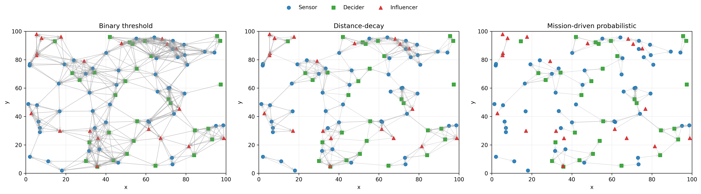

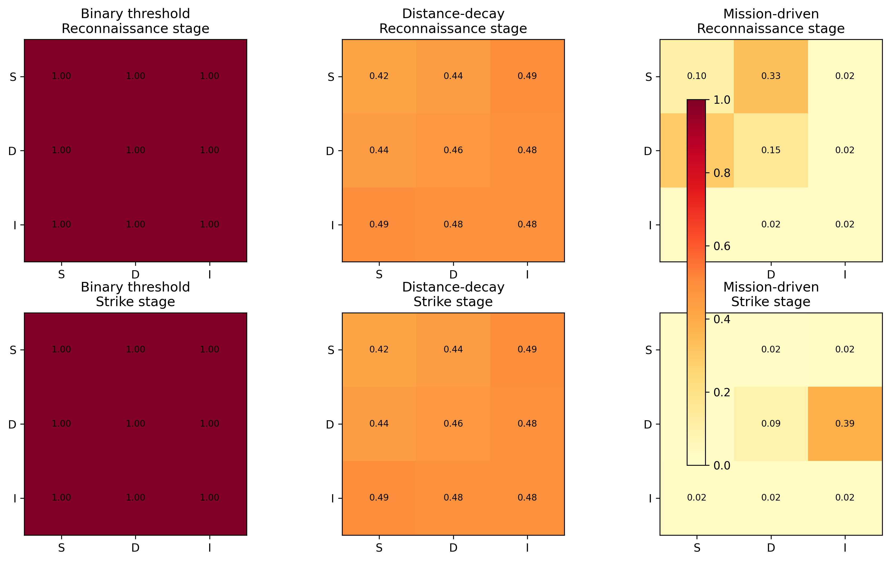

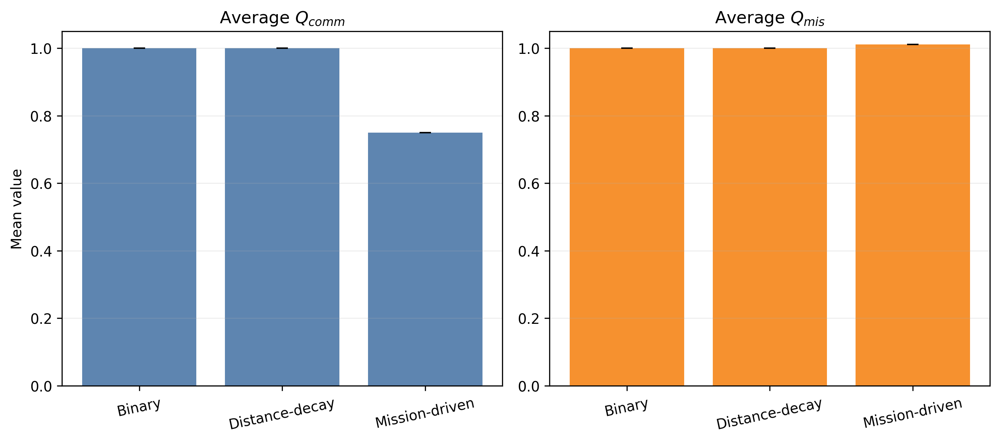

## 4.3 Multidimensional Performance Degradation under Different Attack Types

### 4.3.1 Attack Types and Experimental Design

Five representative attack scenarios were considered. Physical destruction denotes hard-kill removal of the nodes nearest the swarm center. Network suppression denotes soft-kill suppression of all incoming and outgoing communication links of center-area nodes while leaving the physical topology intact. Random attack denotes indiscriminate hard-kill node removal. Topology-oriented deliberate attack removes the highest-degree nodes in the physical layer. Role-oriented attack preferentially targets decider nodes. To isolate pure degradation effects, no reconfiguration was activated in this section.

**Table 4.3.** Definitions of attack types.

| Attack type | Implementation |
|:--|:--|
| Physical destruction | Hard-kill removal of nodes nearest the swarm center. |
| Network suppression | Soft-kill suppression of all incoming and outgoing links of center-area nodes. |
| Random attack | Hard-kill removal of randomly selected nodes. |
| Topology-oriented deliberate attack | Hard-kill removal of the highest-degree nodes in the physical layer. |
| Role-oriented attack | Hard-kill preferentially targeting decider nodes. |

### 4.3.2 Degradation Results of the Three Performance Layers

The results show a clear separation between the effects imposed on the three network layers. As expected, network suppression does not reduce the physical-layer indicator: $Q_{phy}(t)$ remains at 1.0 throughout the mission, while the communication layer degrades from 0.7197 at the attack time to a post-switch minimum of 0.5049. Because the node set is preserved, the overall resilience under network suppression is the highest among all scenarios, with $R = 0.8632$.

Hard-kill attacks show much stronger cross-layer coupling. Physical destruction and random attack both cause immediate physical degradation, with $Q_{phy}(20)=0.7417$ and 0.7281, respectively. Their mission-layer damage is relatively mild because role balance is not deliberately broken, and their final resilience values remain in the medium range ($R=0.6989$ for physical destruction and $R=0.7343$ for random attack). The main loss in these two scenarios comes from the communication layer, whose post-switch values fall to 0.3866 and 0.3592, respectively.

The two deliberate attacks are substantially more destructive. Topology-oriented deliberate attack reduces $Q_{mis}(20)$ to 0.7353 and ultimately drives the integrated performance down to 0.5678, corresponding to $R=0.5539$. Even more severe is the role-oriented attack against deciders. Because decider nodes are the control hubs connecting observation to strike execution, their removal collapses mission-layer validity almost immediately: $Q_{mis}(20)$ drops to 0.4022, the communication layer reaches a minimum of 0.2764, and the final resilience falls to 0.3901. This result confirms that in the heterogeneous OODA-organized swarm, attacks aimed at role-critical command nodes are more damaging than purely geometric hub removal.

The integrated comparison in Figure 4.7 further shows that damage is not synchronized across layers. Physical destruction and random attack trigger an immediate drop in $Q_{phy}$, while network suppression leaves $Q_{phy}$ unchanged but still reduces $Q_{comm}$ and $Q_{mis}$. The role-oriented attack produces the steepest mission-layer degradation and therefore the lowest resilience. This cross-layer divergence is exactly the phenomenon that motivates the multidimensional framework: a topology-only analysis would underestimate soft-kill attacks, while a communication-only analysis would miss the structural consequences of role depletion.

**Table 4.4.** Final resilience values under different attack types.

| Attack type | Mean $R$ |
|:--|:--:|
| Physical destruction | 0.6989 |
| Network suppression | 0.8632 |
| Random attack | 0.7343 |
| Topology-oriented deliberate attack | 0.5539 |
| Role-oriented attack | 0.3901 |

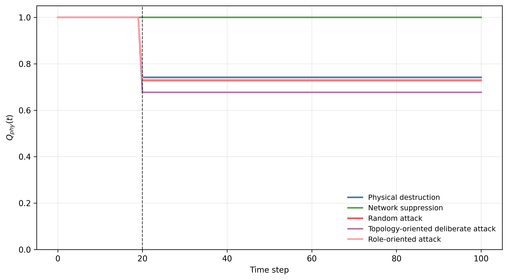

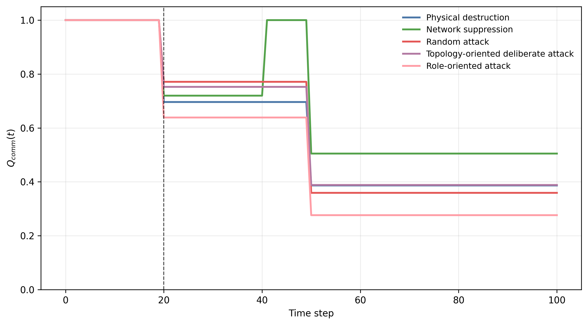

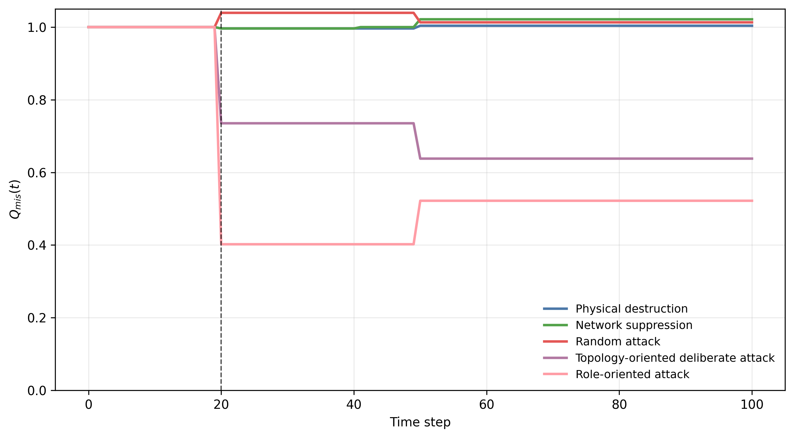

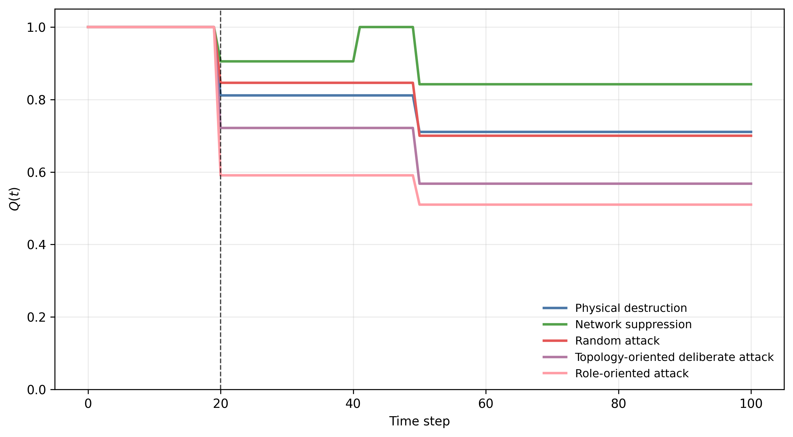

## 4.4 Comparison of Reconfiguration Strategies

### 4.4.1 Reconfiguration Strategies

Four reconfiguration strategies were compared under topology-oriented deliberate hard-kill. The first baseline was no reconfiguration, in which the surviving nodes remained at their post-attack positions. The second baseline was nearest-neighbor reconfiguration, where each surviving node moved toward its nearest alive peer. The third baseline was centroid-based recovery, where all surviving nodes moved toward the current swarm centroid. The fourth was the proposed utility- and role-driven reconfiguration, in which connected nodes moved toward high-utility, role-compatible anchors and isolated nodes preferentially reconnected to deciders or the remembered swarm center.

**Table 4.5.** Definitions of reconfiguration strategies.

| Strategy | Definition |
|:--|:--|
| No reconfiguration | Nodes remain at their post-attack positions. |
| Nearest-neighbor reconfiguration | Each surviving node moves toward its nearest alive peer. |
| Centroid-based recovery | All surviving nodes move toward the swarm centroid. |
| Utility- and role-driven reconfiguration | Connected nodes follow high-utility role-compatible anchors, while isolated nodes reconnect toward deciders or the remembered centroid. |

### 4.4.2 Recovery Performance under Different Reconfiguration Strategies

All active recovery strategies improve performance relative to the no-reconfiguration baseline, but they do so in different ways. Without reconfiguration, the system remains trapped at a low post-attack level, with minimum and final integrated performance both equal to 0.5678 and final mission-layer performance only 0.6380. Nearest-neighbor reconfiguration offers a modest improvement, increasing resilience to 0.6209 and final $Q_{mis}(t_r)$ to 0.8887, but it still cannot fully reconstruct a coherent command backbone.

Centroid-based recovery yields the strongest aggregate rebound in the present benchmark scenario. It restores the system above 90% of the initial integrated performance in 13 time steps and achieves the highest resilience value, $R=0.8845$. This result indicates that under severe hub-oriented hard-kill, rapid geometric contraction is very effective at re-establishing dense physical and communication connectivity.

The proposed utility- and role-driven strategy performs differently. Its minimum integrated performance is the same as that of centroid-based recovery (0.7216), but its rebound is slower, producing a recovery time of 16 steps and a lower resilience value of 0.8057. However, it attains the highest final mission-layer performance, $Q_{mis}(t_r)=1.0215$, slightly above centroid-based recovery (1.0103). This means that the proposed method is more effective at reconstructing role-consistent kill chains by the mission end, even though it does not maximize the time-weighted integrated area under the current parameter setting. In other words, centroid-based recovery is superior for rapid global reconnection, whereas the proposed method is more targeted toward final mission-chain correctness.

This distinction is important for operational interpretation. If the design objective is the fastest integrated recovery under hub-removal attack, centroid-based contraction is the strongest baseline in the tested setting. If the design objective emphasizes the quality of the restored mission chain at the end of the mission, the proposed strategy retains a clear advantage over the purely geometric baselines and remains substantially better than no reconfiguration and nearest-neighbor movement.

**Table 4.6.** Recovery time, minimum performance, final mission-layer performance, and resilience under different strategies.

| Strategy | Minimum $Q(t)$ | Recovery time | Final $Q_{mis}(t_r)$ | Mean $R$ |
|:--|:--:|:--:|:--:|:--:|
| No reconfiguration | 0.5678 | N/A | 0.6380 | 0.5539 |
| Nearest-neighbor reconfiguration | 0.6548 | N/A | 0.8887 | 0.6209 |
| Centroid-based recovery | 0.7216 | 13.00 | 1.0103 | 0.8845 |
| Utility- and role-driven reconfiguration | 0.7216 | 16.00 | 1.0215 | 0.8057 |

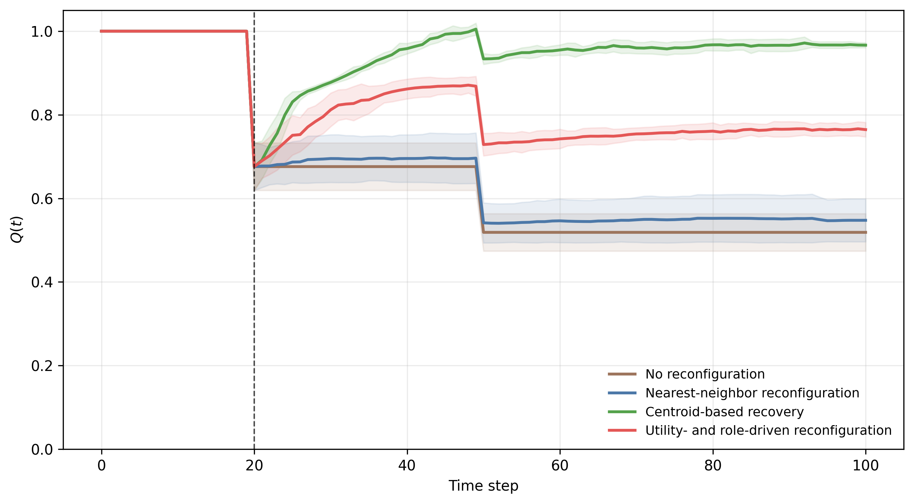

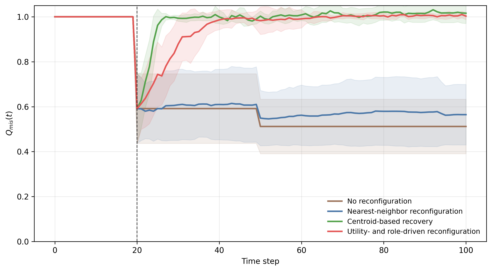

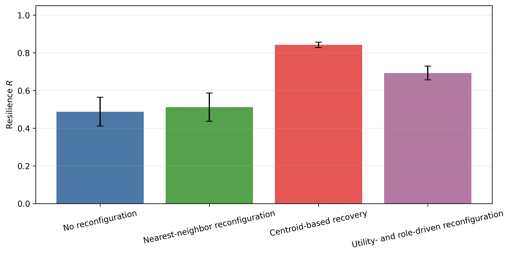

## 4.5 Sensitivity Analysis and Discussion

### 4.5.1 Sensitivity Analysis of Key Parameters

The sensitivity analysis was performed around the topology-oriented deliberate-attack benchmark with the proposed communication and reconfiguration models. Figure 4.11 shows the communication-parameter effects. Resilience is not monotonic in the communication radius: $r_c = 20$ yields the best result ($R=0.8057$), while increasing the radius to 24 reduces resilience to 0.7621. This implies that excessive communication reach can dilute the ordered, stage-specific backbone and does not necessarily improve mission-oriented robustness. The distance influence factor shows a smaller but still visible effect, with $\eta = 0.20$ outperforming both 0.10 and 0.40.

Figure 4.12 and Table 4.7 show that the most sensitive parameter in the tested range is the reconfiguration step size $v_s$, whose resilience spread reaches 0.0882. Increasing $v_s$ from 0.5 to 1.5 raises resilience from 0.7512 to 0.8393, indicating that slow repositioning is a major bottleneck after hard-kill attack. The mission baseline $Q_{min}$ is the second most sensitive factor, with a spread of 0.0567, which is expected because it directly changes how much of the post-attack trajectory contributes to resilience accumulation. The mission-link threshold $\tau_{mis}$ also matters: a too-large threshold of 0.020 suppresses valid mission chains and reduces resilience to 0.7738, whereas values around 0.010 provide a better balance between selectivity and chain availability. The balanced role composition $50:30:20$ achieves the highest resilience among the tested ratios, outperforming both a sensor-heavy configuration ($60:25:15$) and a decider-heavy configuration ($45:35:20$).

**Table 4.7.** Summary of parameter sensitivity and design implications.

| Parameter | Resilience spread | Best setting | Worst setting |
|:--|:--:|:--:|:--:|
| Communication radius $r_c$ | 0.0436 | 20 | 24 |
| Distance influence factor $\eta$ | 0.0294 | 0.20 | 0.10 |
| Mission baseline $Q_{min}$ | 0.0567 | 0.20 | 0.40 |
| Time sensitivity $\lambda$ | 0.0211 | 0.02 | 0.08 |
| Mission-link threshold $\tau_{mis}$ | 0.0320 | 0.010 | 0.020 |
| Reconfiguration step size $v_s$ | 0.0882 | 1.5 | 0.5 |
| Role composition ratio $S:D:I$ | 0.0248 | 50:30:20 | 60:25:15 |

### 4.5.2 Discussion on Design Implications

Three design implications follow from the sensitivity results. First, resilience depends more on structured communication than on maximal connectivity. The non-monotonic behavior of $r_c$ and the moderate optimum of $\eta$ indicate that simply enlarging the communication envelope does not guarantee better mission performance; excessive reach may instead introduce low-value interactions that weaken communication orderliness. Second, recovery capability is strongly constrained by mobility. The dominant sensitivity of $v_s$ shows that if surviving nodes cannot reposition quickly enough, even a well-designed role-aware recovery rule will not fully exploit the remaining command structure. Third, balanced role composition remains important. Too few deciders weaken command continuity, while too many deciders reduce sensing redundancy without generating proportional resilience gain.

From an engineering perspective, these observations suggest that UAV-swarm design should favor a moderate communication radius, preserve a balanced $S:D:I$ composition close to $50:30:20$ for the tested swarm size, and allocate sufficient maneuver authority for post-attack regrouping. At the mission-planning level, the resilience metric is also sensitive to $Q_{min}$ and $\lambda$, meaning that threshold and urgency settings should be chosen according to the actual operational tolerance for delayed recovery. Overall, the sensitivity study confirms that communication logic, role composition, and recovery mobility must be co-designed rather than tuned independently.

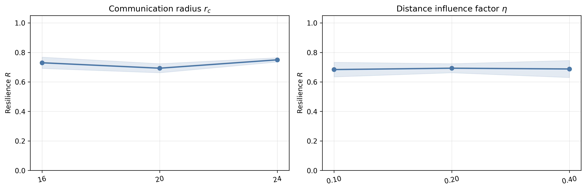

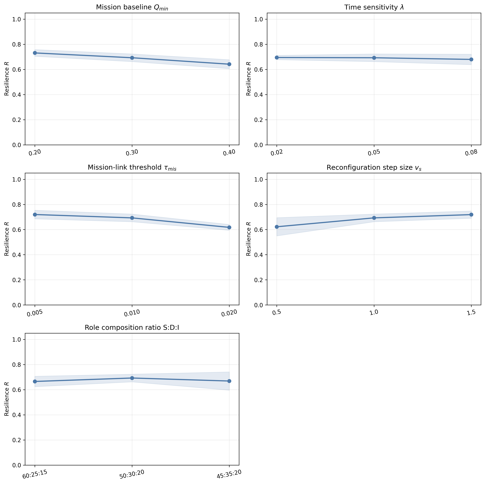
